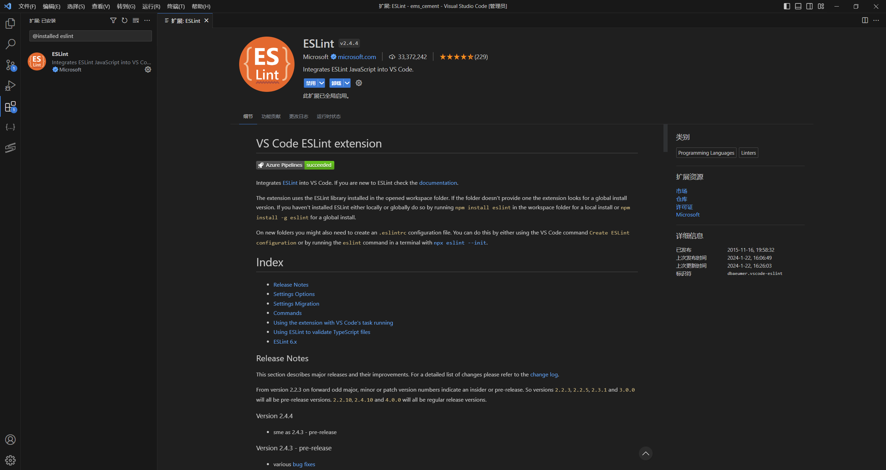
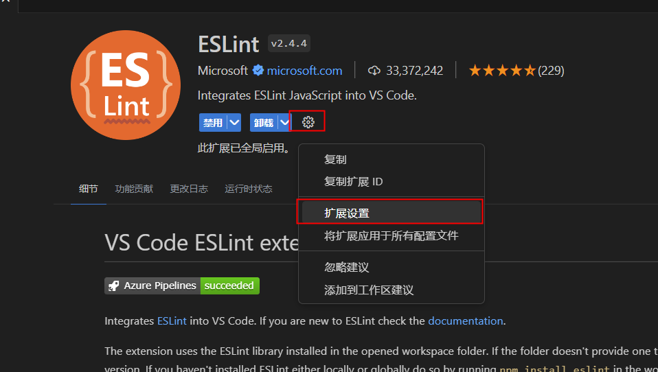
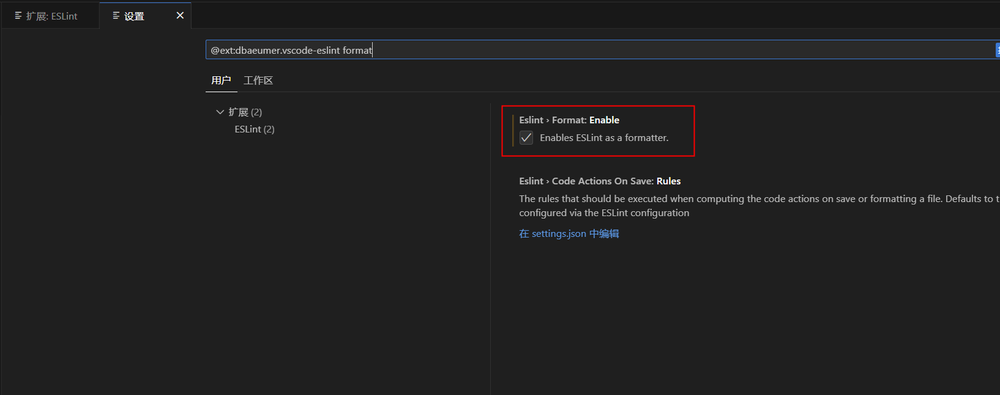
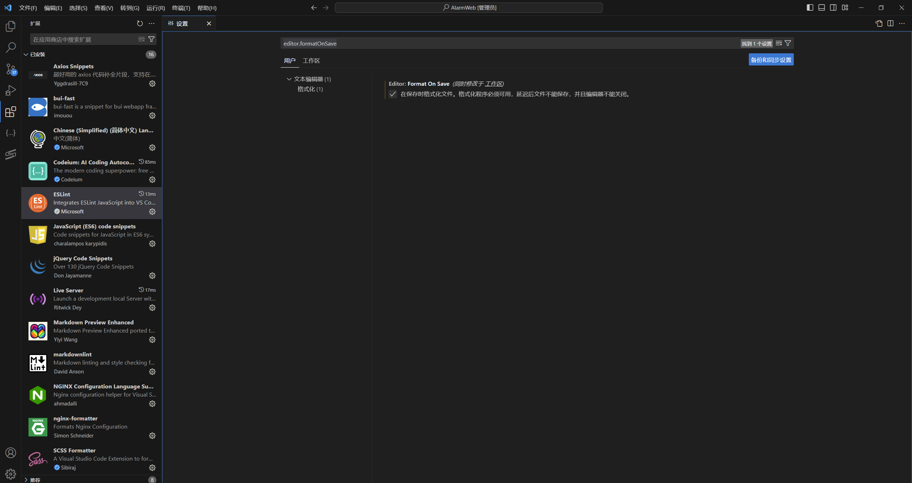
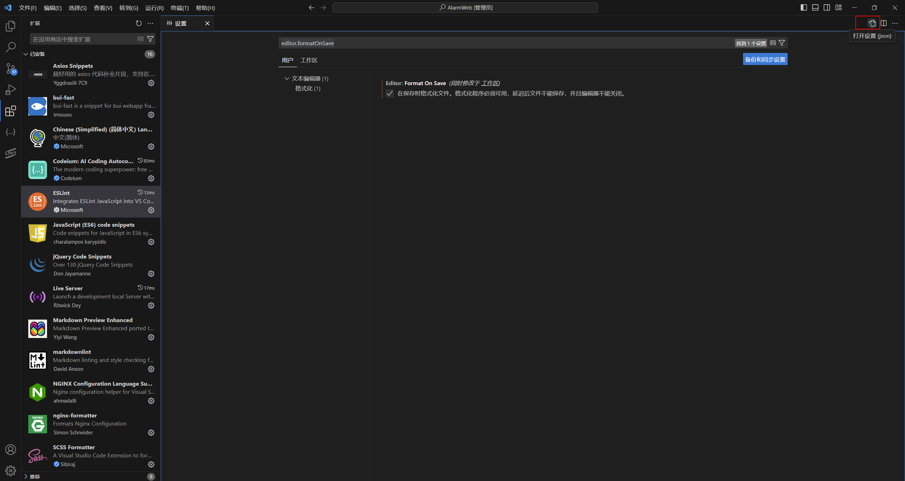
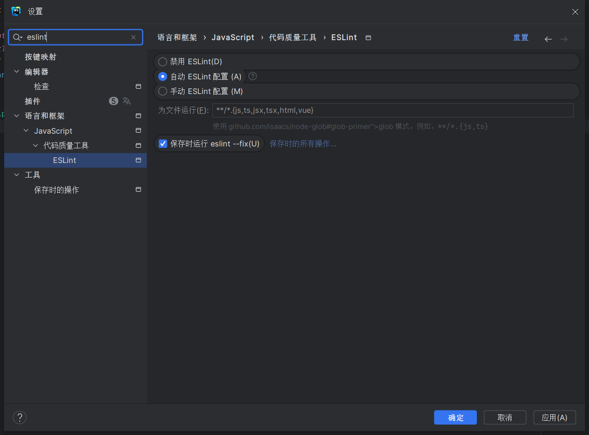

# 编码规范
## 前言
> 现代软件架构的复杂性需要协同开发完成，如何高效地协同呢？无规矩不成方圆，无规范难以协同，比如，制订交通法规表面上是要限制行车权，实际上是保障公众的人身安全，试想如果没有限速，没有红绿灯，谁还敢上路行驶。对软件来说，适当的规范和标准绝不是消灭代码内容的创造性、优雅性，而是限制过度个性化，以一种普遍认可的统一方式一起做事，提升协作效率，降低沟通成本。代码的字里行间流淌的是软件系统的血液，质量的提升是尽可能少踩坑，杜绝踩重复的坑，切实提升系统稳定性，码出质量。——引自《阿里规约》的开头片段。

## 工具配置
工欲善其事，必先利其器。所以我们把工具配置放在第一部分，使用工具可以保障我们在不知道规则的情况下，也能写出符合开发规范的代码。
### VSCode
1. 在扩展市场中，搜索并安装ESLint扩展工具(dbaeumer.vscode-eslint)，如下图。

2. 点击扩展设置。

3. 搜索format设置并启用ESLint的format功能。

4. 在设置页面搜索editor.formatOnSave并启用该功能。

5. 点击右上角的打开设置按钮，进入源码编辑视图。

6. 粘贴如下代码
```json
  "[vue]": {
    "editor.defaultFormatter": "dbaeumer.vscode-eslint"
  },
  "[javascript]": {
    "editor.defaultFormatter": "dbaeumer.vscode-eslint"
  },
```
至此，就完成了vscode的相关配置。

### WebStorm(全家桶相通)
webstorm的配置相对比较简单，配置方法如下：
1. 打开设置搜索eslint

2. 选择自动ESLint配置和保存时运行eslint --fix即可。


## 具体规则

## 继承公共规则
我们继承了`eslint:recommended`、`airbnb-base`、`plugin:vue/vue3-recommended`三个公共规则
继续传送门：[eslint](https://eslint.org/docs/latest/)、[airbnb-base](https://github.com/airbnb/javascript)、[plugin:vue/vue3-recommended](https://eslint.vuejs.org/rules/)

## 自定义规则
我们还自定义了一些符合团队现状的规则

### 强制：vue组件使用烤肉串写法
```vue
<template>
  <!-- ✓ GOOD -->
  <cool-component />

  <!-- ✗ BAD -->
  <CoolComponent />
  <coolComponent />
  <Cool-component />

  <!-- ignore -->
  <unregistered-component />
  <UnregisteredComponent />
</template>
<script>
export default {
  components: {
    CoolComponent
  }
}
</script>
```

### 强制：变量命名使用驼峰，但属性名可以使用下划线
```js
/*eslint camelcase: ["error", {properties: "never"}]*/

// bad code
let ver_name = 1;

// good code
let verName = 1;

// allow properties
let obj = {
    my_pref: 1
};

obj.foo_bar = "baz";
```

### 强制：单行最大长度120
除了注释 和 svg的d属性

### 警告：console和debugger
```js
// warn
console.log('XXXX')

// warn
debugger
```

### 警告：对外部作用域中声明的影子变量进行变量声明
```js
let a = 3;
function b() {
  // warn
  let a = 10;
}
```

### 禁止：混合函数入参
```js
function name(prop) {
  // bad
  prop = 10
  
  // allow but not good
  prop.name = 10
}
```
